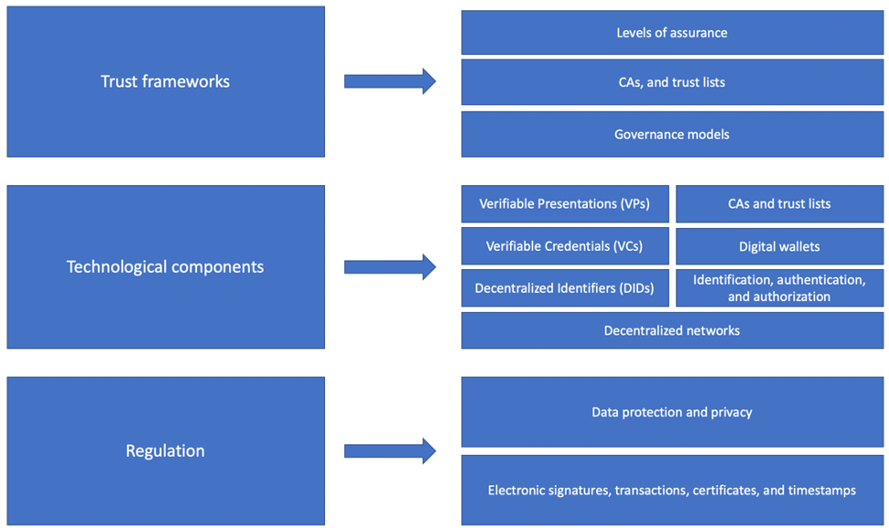
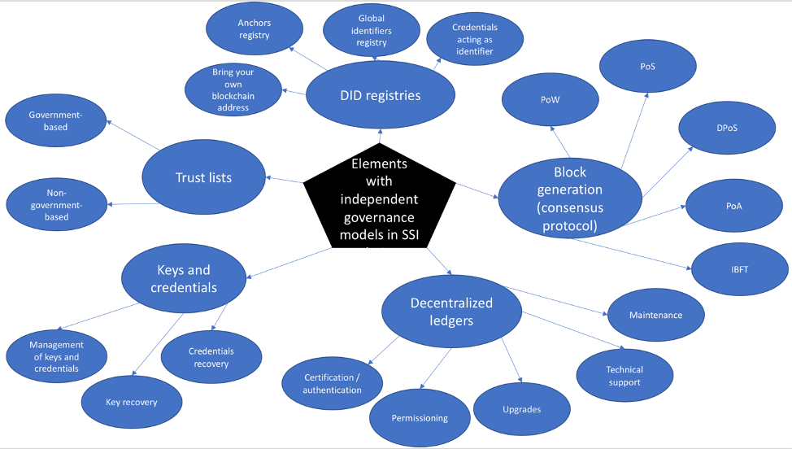

# LACChain ID

LACChain ID is the second layer of the blockchain-based infrastructure that the LACChain Alliance is making available for enterprise use of blockchain in Latin America and the Caribbean. This second layer complements the first layer of public-permissioned blockchain networks by enabling the authentication and identification of the entities (individuals, organizations, things and processes) using the infrastructure. Assigning proper identifiers, it allows, as a principal use, to establish the ownership of the digital assets and settle legal accountabilities and responsibilities. The identity layer of LACChain is also essential for the third layer: Tokenized Fiat Money. It would not be possible to tokenize and transfer digital money in compliance with regulations without an identity layer allowing KYC and AML processes.

The partners collaborating with IDB Lab, the entity leading the LACChain Alliance, in the LACChain ID layer are Everis, Grupo Sabra, Idemia, IECISA, Latam Link, Multiledgers, RSK/IOVLabs, uPort, and World Data. The main goals of this working group are: 

*	A published report covering the state of the art of the technology, relevant regulations, and the trust frameworks related to self-sovereign identity (SSI).
*	The elaboration of the LACChain ID techno-legal framework for self-sovereign identity using blockchain.
*	The collaboration between different digital wallets to use the same standards and protocols and achieve interoperability between identifiers and credentials over LACChain Networks.
*	The promotion and support of a series of public and private initiatives in Latin America and the Caribbean that incorporate blockchain-based self-sovereign identity.

## The LACChain ID techno-legal framework (work in progress)

Regulation is the first layer of any identity model, including digital identity based in a self-sovereign identity (SSI) model. In the SSI model there are several new technological elements that are not properly addressed by current regulations. For instance, some countries have not regulated the use of electronic signatures, and a higher number of countries do not have modern data protection regulations. 

The SSI model requires new technological components, standards, and protocols. At present, these three elements are under development, at different levels of maturity. We classify the technological components into seven categories:  Decentralized identifiers (DIDs); verifiable credentials (VCs); verifiable presentations (VPs); authentication, authorization, and identification; digital wallets; certificate authorities (CAs) and trust lists (TLs); and decentralized ledgers (DLTs). 

A SSI model’s operation requires a “trust framework”.  According to the Open Identity Exchange (OIX) a trust framework is a is a “generic term often used to describe a legally enforceable set of specifications, rules, and agreements that govern a multi-party system established for a common purpose, designed for conducting specific types of transactions among a community of participants, and bound by a common set of requirements. […] They are referred to as operating regulations, scheme rules, or operating policies in contexts different from digital identity”. In a digital identity ecosystem, whether it is self-sovereign or not, a trust framework defines the governance model, the certificate authorities, the identity providers, the levels of assurance, and the communication channels, among others, allowing to establish root of trust, trust lists, revocation lists among other necessary trust elements.

# 1. Regulation

LACChain is developing all the technological solutions in alignment with the regulation of those countries where these solutions are being implemented. LACChain also ensures that data privacy and protection are compliant with the strictest standards of every country.

# 2. Technology

## 2.1 Decentralized identifiers (DIDs)

A DID should point to a DID document that contains information about the authentication methods to prove ownership of that DID, endpoints, and other attributes. A DID document is comprised of the following standard elements:

*	A Uniform Resource Identifier (URI) to uniquely identify terminology and protocols that allows parties to read the DID document 
*	A DID that identifies the subject of the DID document 
*	A set of authenticators (i.e. public keys) used for authentication, authorization, and communication mechanisms, associated to the authentication methods
*	A set of authentication methods used for the DID subject to prove ownership of the DID to another entity
*	A set of authorization and delegation methods for allowing other entities to operate on behalf of the DID subject (i.e. holders different from the subject).
*	A set of service endpoints to describe where and how to interact with the DID subject
*	A timestamp for when the document was created
*	A timestamp for when the document was last updated
*	Cryptographic proof of identity (e.g. digital signature)

LACChain promotes DID methods that:

*	Allow responsible use of biometrics (by wallets and applications used to operate these DIDs)
*	Have more than one authentication method (e.g. RSA, EC, post-quantum keys, and biometrics)
*	Have more than one authenticator for each authentication method (e.g. several RSA public keys).
*	Use quantum-safe cryptography for the authentication, encryption, and signature 
*	Destroy the seed of the DID so it cannot be re-generated by a hacker in case of theft
*	Do not disclose any personal data or information in the DID documents
*	Guarantee privacy and pseudonymity in the use of the DIDs
*	If the DID was generated from a private key, do not use the associated public key for authentication, encryption, or signature.
*	Register the DIDs in a smart contract with a well-defined governance (an on-chain DID registry)
*	Be scalable enough to economically afford the generation of the required amount of DID for the specific use case in the chosen network. 
*	Set different functionalities for the different keys, so that some primary keys can be used for authentication, some secondary keys can be used for temporary delegation, and some tertiary keys can be used for retrieving primary and secondary keys
*	Store the DID documents in the blockchain so that issuers or verifiers that must resolve specific DID can easily find them

LACChain is committed to maintain a DID registry and resolver of those DID methods deployed on the LACChain Blockchain Networks that meet the LACChain ID requirements.

## 2.2. Verifiable credentials (VCs)

### 2.2.1. Format

Verifiable credentials shall have the following elements:

*	URI to uniquely identify the credential and/or the subject of the credential (e.g. DIDs)
*	URI to identify the issuer (e.g. a DID)
*	URI to identify the credential type 
*	URI to identify terminology and protocols that allow parties to read the credential 
*	Cryptographic proof of the issuer 
*	Claims data or metadata to access it 
*	Issuance date
*	Expiration conditions 
*	Location of the credential status (e.g. a smart contract in a blockchain network)

The LACChain Alliance is working on different verifiable credentials for various use cases that will propose and promote as an international opensource resource. Examples currently under implementation include digital diplomas, corporate credentials, property titles, housing certificates, and client registries among others. LACChain actively promotes verifiable credentials that satisfy the following conditions:

*	The subject's and issuer's DIDs can be found and resolved in the blockchain
*	Claims data or metadata from the credential are never registered in the blockchain
*	Expiration conditions can be automatically checked from the credential
*	Credential status can be verified against a smart contract living in the blockchain, and nobody but the issuer shall be able to change it. 

The preferred format for verifiable credentials is JSON-LD. 

### 2.2.2. Revocation

Clear revocation rules shall be defined for each credential so it is clear who and under which conditions can change the status. Some examples are:

*	Status is automatically set as "active" when the credential is issued by the issuer.
*	Issuers can change the status to "revoked" when the subject ceases meeting the claims attested in the credential.
*	Issuers can change the status to "suspended" when the subject reports that the credential or the authenticators or proofs associated have been compromised.
*	Issuers can change the status to "revoked" when the user reports that they do not want to use the credential anymore.
*	Subject or holder can change the status to "suspended" when the credential or their keys have been compromised.
*	Subject or holder can change the status to "revoked" when they no longer want to use the credential.
*	The status of the credential is automatically changed after the expiration date.

### 2.2.3. Storage

Repositories for verifiable credentials are typically digital wallets that also allow to generate verifiable presentations and share them with others. In the off-chain model encouraged by LACChain, credentials are stored in and protected by the software or hardware chosen by the user. The use of mobile apps such as digital wallets is seen as the most reasonable option in terms of security and convenience.

### 2.2.4. Exchange

There are at least three types of exchange of credentials. 

**Issuance:** The credential is sent from an issuer to the requester, holder, or subject.

**Delegation/Transference:** The credential is exchanged between requester, holder, and subject.

**Presentation:** The credential is sent from a holder to a verifier.

For all the types of exchanges of credentials, the digital channels between the repository where the credential is stored (i.e. the digital wallet) and the service that generates or consumes the credential must be secure and protected. 

It should be possible to do anonymous peer-to-peer and anonymous presentation of credentials. 

A use case currently under development in the context of the COVID-19 pandemic is to exchange verifiable credentials to prove someone that you were in contact with in case  you become aware that you are COVID-19 positive without disclosing who you are or when was the contact. 

## 2.3. Verifiable presentations (VPs)

### 2.3.1. Format

Verifiable presentations shall include:

*	URI to uniquely identify the presentation 
*	URI to uniquely identify the type of the object 
*	One or more verifiable credentials or claims derived from them 
*	URI to identify the entity generating the presentation (e.g. DID)
*	Cryptographic proof of the subject (e.g. digital signature)

Verifiable presentations may also include information about a targeted audience or verifier that the credential was issued for

The preferred format for verifiable presentations is JSON-LD.

#### 2.3.2. Verification process

The process for the verification of digital credentials is not standardized and, in general, it is not rigorous enough either. We have defined the Verification Process that is presented in this section, which allows any verifier entity to accomplish diligent electronic verifications of digital credentials presented to them by holders.

In any electronic interaction there are two types of verifications: the verification of the electronic information that is exchanged between parties or presented from one party to the other, and the verification of the physical entities behind the digital personas involved in the digital interaction. In the SSI model, individuals store, manage, and present credentials using digital wallets. In general, when a holder presents a credential to a verifier electronically, they first need to establish a communication channel between the holder´s digital wallet and the verifier´s digital service (e.g. https).

When the verifier receives the credential, they are capable of verfying all the electronic information (i.e. validity of the credential, status, issuer, presenter, and claims) against the blockchain network, as described in Steps 2 to 6. However, the verifier cannot verify directly that the person in control of the device that is sending the digital credential (the presenter) is truly the holder. The verifier needs to trust that the digital wallet used by the presenter accomplishes a diligent authentication process to authenticate users, so no unauthorized user can access other´s credentials and present them on their behalf. This is why the Step 1 of out Verification Process consists of the verification of the digital wallet as a trusted service.

Some regulatory frameworks, such as eIDAS in Europe, introduce the concept of electronic trust services. This allows electronic services that meet specific requirements to be certified and recognized with a certain level of assurance for the provision of electronic services for electronic identification. We believe that it is essential for digital wallets to become some kind of trusted services according to the different regulatory frameworks in order be trusted by verifiers in the authentication of users. This also requires modification of the regulations. The certification of digital wallets as trust services is essential for the scalability of SSI. 

**Step 1: Verification of the digital wallet:** the digital wallet provider guarantees that the presenter of the credential has been authenticated to the wallet with a certain level of assurance. The digital wallet provider assumes a liability for this guarantee.

**Step 2. Verification of the validity of the credential (or validation):** the verifier verifies that the structure, the format, and the context are correct. All this information is contained in the credential and can be automatically verified by a verification service. Standardization of structure, format, and context will enable worldwide recognition, which will be fundamental  for uses such as digital passports, digital diplomas, or digital property titles.

**Step 3. Verification of the status of the credential:** the verifier verifies that the credential has an active status. LACChain encourages the use of smart contracts maintained by the issuers of credentials for CRLs. In this case, credentials would contain a field that indicates the address of the smart contract where the identifier of the credential is associated to a dynamic status. Only when the status is active, the Step 2 of the verification shall be considered successful.  

**Step 4. Verification of the issuer:** the verifier verifies the identity (i.e. the digital signature) of the issuer, and the chain of trust behind their identity, if applicable. To trust the issuer, the verifier will need to know their real identity (i.e. a Verifiable ID). In principle, the credential presented by the holder only contains the DID and digital signature of the issuer, but not additional information about their identity. That digital signature might be unknown for or untrusted by the verifier. In that case, in order to verify the issuer’s real identity, it must be possible for the verifier to know how to access the root of trust behind it. That requires roots of trust that end in a root certificate authority (CA) that is trusted by the verifier. We recommend the use of on-chain DNS using smart contracts.

**Step 5. Verification of the presenter:** The verifier verifies that the presenter is authorized to present that credential, either because it is the subject or because has been authorized to it. In the first case, the presenter will be able to prove that they are in control of the DID, by solving a challenge to one of the authentication methods. In the second case, there are at least two options. Option one is that the presenter is given one of the private keys required for the authentication of that DID. Option two is that the credential specifies that a DID different from the subject can present the credential, which would be the presenter DID. 

**Step 6. Verification of the claims:** If all the previous steps are successful, the verifier finally gets the information claimed in the verifiable credential and trusts it.

### 2.3.3. Traceability and monitoring

When the off-chain storage of credentials is adopted:

*	The exchange of credentials also happens off-chain, so it does not leave any track in the registry.

*	The verification of credentials queries the registry but without generating transactions so there is no traceability.

This helps meeting data privacy requirements. HHowever, in some cases the exchange and verification of credentials is intended to be known. This may be the case when measuring the impact of and providing feedback for the solution is important. In this case, the the following apply:

*	Scalable approaches in terms to register transactions in the ledger when the credentials are presented and verified should be designed for each solution. 

*	Data privacy shall be preserved, including the PII that can be derived from exchanges and verifications. Only quantitative data shall be registered in the ledger and aggregated data shall be collected.

## 2.4. Digital repositories and wallets

A digital wallet is a private repository that allows its owner to store, manage, and present keys and identity credentials. A digital wallet should:

*	Provide secure access to the holder, by guaranteeing that only authorized entities can access it.
*	Ensure security and strong data encryption.
*	Provide recovery of keys and credentials.
*	Be connected to the ledgers where the DID registries, the trusted lists, and the cryptographic proofs of the DID documents and credentials are stored.
*	Provide mechanisms for subjects and issuers to change the status of their credentials.
*	Provide mechanisms for the owner to erase all the data associated with them

A digital wallet may:

*	Keep transactional information about the holders/subjects, if authorized to do so.
*	Provide dashboards of activity.
*	Provide mechanisms for reducing PII of the entities activities by combining the use of different DIDs for different interactions.
* Be certified and/or audited to be acknowledged as a trusted service.

## 2.5. Distributed ledger technology

It is essential for SSI to rely on decentralized ledgers for the storage of the cryptographic proofs of DIDs, the cryptographic proofs and status of verifiable credentials and presentations, the DNS, and the trusted lists, among others. Using blockchain networks provides SSI with the security and the scalability that this digital identity management system pursues. Blockchain networks are specific types of decentralized ledgers characterized by their use of smart contracts to automate processes and represent digital assets. Blockchain networks also contain consensus protocols to generate new blocks and all nodes maintain the same copy of information. Blockchain networks are more suitable for self-sovereign identity than other types of decentralized ledgers because blockchain addresses can be used as DIDs, smart contracts can be used as trusted lists, and they do not require various versions or siloes of information be used between different entities in the network.

According to the International Standards Organization (ISO), there are three types of blockchain networks: 

**Permissionless:** Permissionless networks are those that anyone can join at any time, such as Bitcoin or Ethereum. Most of these networks are generally crypto-based . They are open and transparent, but generally have high transaction fees, no privacy , and all users are pseudonymous. Additionally, as participants are not identified, transactions and applications can hardly be forced to be compliant with regulation.

**Permissioned private:** Permissioned private networks consist of a consortium of finite and well-defined entities that deploy, run, and maintain all the nodes. Generally, these networks are developed, and even maintained, by a blockchain service provider. In general, private networks, do not have transaction fees (although there might be a fixed cost charged by the service provider if applicable), and allow for high levels of privacy. However, these networks are not decentralized nor transparent and the scalability is very limited. In addition, they are usually designed for a single use case or application. Examples of permissioned private networks include the hundreds of private blockchain networks behind specific blockchain applications, the IBM FoodTrust,  and the blockchain network of the Energy Web Chain by the Energy Web Foundation (EWF) consortium.

**Permissioned public:** In a permissioned public network, a consortium initiates a network and allows everyone to join, provided that they meet certain requirements, such as being authenticated and compliant with regulations. In these networks, the consortium is self-sufficient and does not need to rely on a vendor. Permissioned public networks are open, transparent, decentralized, and do not have transaction fees. At the same time, every participant is identified so both privacy and compliance with regulation are enabled. Examples of these networks are Alastria in Spain, led by an association of over 500 members; EBSI in Europe led by the European Union; and LACChain in Latin America and the Caribbean, led by the Inter-American Development and its partners in the program.

The self-sovereign identity model can leverage different types of blockchain networks in addition to other decentralized ledgers. However, permissioned public networks are the most suitable. Permissionless networks are designed to be anonymous and permissioned private networks are designed to be small and limited to specific use cases. Alternatively, permissioned public networks often have zero transaction fees, are compliant with regulations, and are designed to be multipurpose, making them a perfect fit for the decentralized ledger that self-sovereign identity demands. 

# 3. Trust frameworks

## 3.1. Governance

According to the Open Identity Exchange (OIX), a trust framework is a “generic term often used to describe a legally enforceable set of specifications, rules, and agreements that govern a multi-party system established for a common purpose, designed for conducting specific types of transactions among a community of participants, and bound by a common set of requirements". LACChain introduces the LACChain ID governance model, that distinguishes different governance layers of an SSI ecosystem. We understand that there are, at least, five different layers with independent governance: the decentralized ledger, the block generation, the DID registry, the trusted lists, and the management of keys and credentials. When the ecosystem is government-based, the government will be very likely responsible for all or most of the layers. 

### 3.1.1. Governance of the network

According to ISO/TC 307 SG 5 “DLT and blockchain systems governance is an approach that comprises elements of central and decentral decision rights, where the accountability is situated within the network and where incentives are provided to reach consensus […]. The governance of a DLT & blockchain systems oversees several key functions during the operational stage of the DLT & blockchain system, such as the enrolment of participatory rights for participants in the DLT & blockchain system and the contracting rules associated with participation in the DLT & blockchain system. All DLT & blockchain systems shall operate within the broader context of external legal and regulatory frameworks; in some case DLT & blockchain systems may provide guidance and on-chain mechanisms for managing the operation […]. The DLT and blockchain systems governance lifecycle view addresses both the risks inherent to and the interests of DLT participants and broader stakeholders during the establishment, operation, and termination of the DLT system ”  

We understand that the essential tasks that comprise the governance of a decentralized registry or blockchain network can be divided into the three phases of the lifecycle: establishment, operation, and termination. These tasks are:

**Establishment**

* Definition of the economic incentives: definition of the economic incentives to guarantee the sustainability of the blockchain.

* Definition of the techno-legal framework: definition of the framework that allows to establish the technical and legal body of the blockchain.

* Deployment of the genesis block: construction and deployment of the first block of the network that contains both soft (e.g. the initial validator nodes) and hard rules (e.g. the consensus protocol).

**Operation**

* Certification/authentication of nodes: providing nodes with an identity (e.g. a digital certificate) in the network that others recognize and that can be used for authentication and signature of transactions. 

* Gas/resources distribution: managing the distribution of network resources between different users. Guaranteeing that the network always operates, even under high stress.

* Maintenance of the network: maintaining the network to guarantee that the network runs without issues and will not fail, collapse, or die.

* Monitoring: providing dashboards and monitoring tools and performing monitoring tasks.

* Permissioning: allowing nodes and accounts to join the network (i.e. whitelisting) and removing them (i.e. blacklisting) when they violate the agreements.

* Technical support: providing technical assistance in case something fails in the deployment or performance of nodes or applications on top of the network.

* Upgrades: proactive research and developments in the network to improve security, efficiency, scalability, performance, and interoperability.

**Termination**

* Access to the history: guaranteeing access to the history of transactions.

* Management of assets and data: determining of how data or assets (e.g. smart contracts, tokens, proofs of certificates) are transferred, destroyed, or disposed. 

### 3.1.2. Governance of the block generation

The governance of the block generation is determined by the consensus protocol. It consists on who and under which conditions can operate a node that generates blocks, and what is the process for the block generation between the validators.

### 3.1.3. Governance of the DID registries

Each of the types of DID registries has a different governance model:

**Credentials registry acting as identifier:** each subject deploys a dedicated smart contract to register the DID. The subject is in complete control of the registry.

**Global identifiers registry:** because a single monolithic smart contract is deployed in the ledger to act as a global registry, the governance of the smart contract becomes governance of the DID registry. Different options are possible, including management by a centralized entity, a limited number of accounts, or a DAO.

**Anchors registry:** same as in the global identifiers registry.

**Bring your own blockchain address:** : in this case, there is no such a thing as an on-chain DID registry. The management and storage of DIDs is done off-chain by the subject and/or holder, and resolving a DID is accomplished through iterations over its registries (transactions) in the ledger.  

### 3.1.4. Governance of the trusted lists

Depending on the trust framework, different entities will be responsible for maintaining trusted lists. We can classify the governance of the trusted lists in two types, depending on if the government is playing the main role in the trust framework or not.

**Government-based:** A government either is the root CA or designates a list of root CAs. The government also set the rules for who and how can issue qualified certificates to others.

**Non-government-based:** The government is not the root CA, and through private-agreements a trust framework emerge so different entities decide to trust other entities as root CAs.

### 3.1.5. Governance of the keys and credentials 

The governance of the keys and credentials includes:

•	Who can have access to the keys and credentials of a subject
•	Who can present a credential to others and under which conditions
•	Where are the back-ups
•	Who can facilitate the key recovery for a subject
•	Who is responsible and liable for a loss or theft of keys and credentials

## 4. The governance of LACChain ID

LACChain ID is developing a solution proposal to provide a scalable, decentralized, and transparent governance, that offers all the guaranties with regards to legal matters.

**Governance of the decentralized network:** L-Net, an orchestration non-profit legal vehicle currently in process of incorporation.

**Governance of the block generation:** Any entity can become a block generator (a validator node) if it satisfies the technical and legal requirements and becomes and signs a SLA. The consensus protocol also incorporates: the verification that the transaction was broadcasted by an authorized node and the automatic rotation of nodes according to decentralization and performance.

**Governance of the DID registries:** Although the governance will vary depending on the DID method, it will be typically based on a contract governing actions by the digital wallet, the identity issuer, or a trusted third party.

**Governance of the trusted lists:** Governance of trusted lists is fully automatized and based on smart contracts managed by the identity issuers.

**Governance of the keys and credentials:** The subject must be able to decide who to give access to their keys and credentials. Centralized and decentralized options for key recovery will be enabled.

